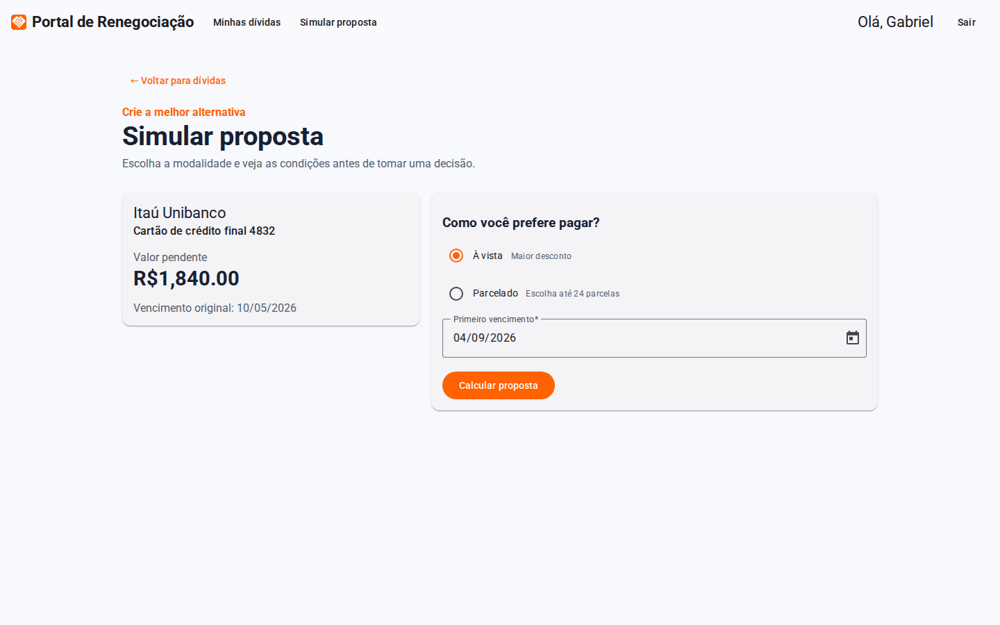
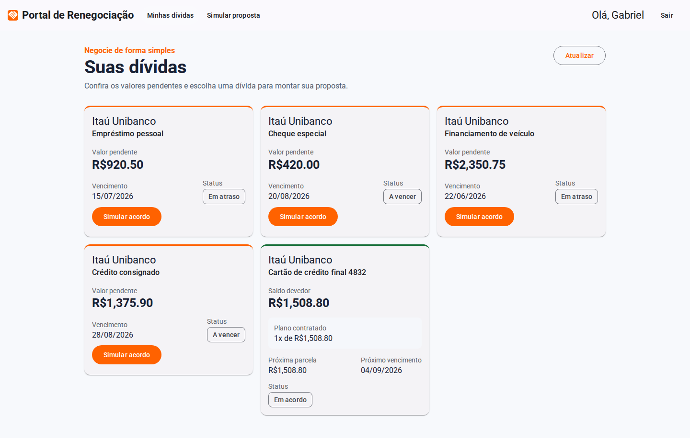
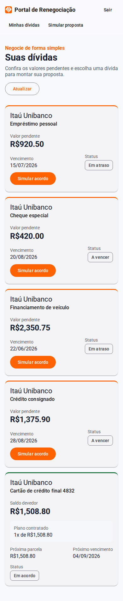
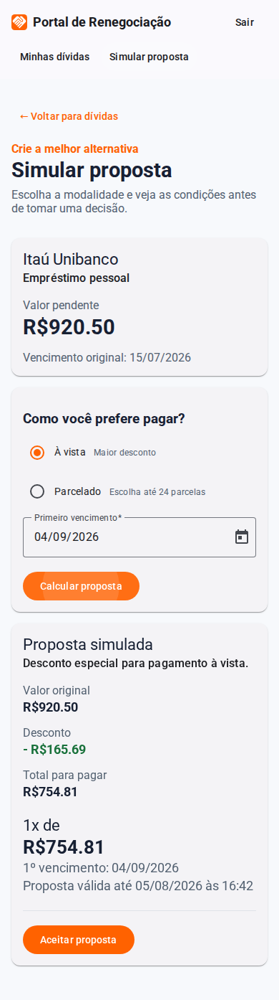
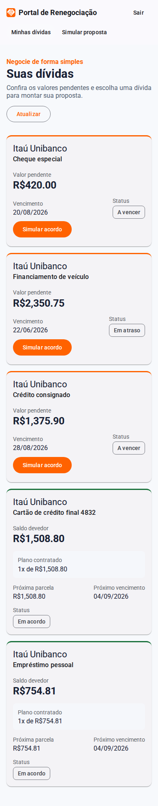
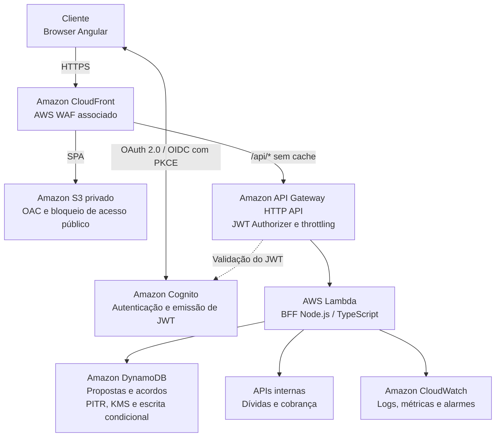

# Renegociação de Dívidas

<!-- Evidências do site: visualização rápida sem rodar -->

**Evidências — Web**

<p align="center">
  
  
  
  
  
</p>

**Evidências — Mobile**

<p align="center">
  
  
  
</p>

Protótipo criado para o desafio de renegociação de dívidas. Conforme a restrição proposta, a experiência possui somente duas telas: **Dívidas** e **Simular proposta**. O login acontece em um diálogo e, como extensão do fluxo, a própria tela de simulação permite confirmar o acordo sem criar telas adicionais.

## Fluxo de negociação

1. O cliente escolhe uma dívida e informa modalidade, parcelas e primeiro vencimento.
2. O BFF calcula e armazena uma simulação temporária identificada, com prazo de validade.
3. O cliente revisa os valores e confirma explicitamente o aceite da proposta.
4. O BFF valida titularidade, validade e elegibilidade antes de criar o acordo.
5. A dívida passa para **Em acordo** e a lista apresenta o saldo negociado, as parcelas e o próximo vencimento, preservando o valor original para auditoria.

O aceite é idempotente: repetir a mesma requisição retorna o acordo já criado, sem duplicá-lo. Quando o arredondamento das parcelas produz diferença de centavos, a última parcela é ajustada para que a soma corresponda exatamente ao valor negociado.

No protótipo, dívidas, simulações e acordos ficam em memória e são reiniciados junto com o backend. Em produção, a consistência deve ser durável: transação quando os dados compartilham a mesma base ou operação idempotente coordenada pelo serviço que é fonte oficial da dívida.

### Aceite da simulação

Depois que a proposta é calculada, a interface exibe valor original, desconto, total negociado, quantidade de parcelas, valor da parcela, eventual ajuste da última parcela, primeiro vencimento e validade da proposta. O botão **Aceitar proposta** abre uma confirmação final; somente ao clicar em **Confirmar acordo** o frontend envia o aceite ao BFF e retorna à lista atualizada.

O backend aceita apenas propostas pertencentes ao cliente autenticado, ainda dentro do prazo de validade e vinculadas a uma dívida que continua elegível. Ao confirmar o aceite, o BFF cria um acordo ativo, registra o horário do aceite, atualiza a dívida para **Em acordo** e impede novas simulações para a mesma dívida. Se a proposta expirar, o cliente deve gerar uma nova simulação.

### Endpoints do fluxo

- `GET /api/dividas`: lista as dívidas e os dados de eventual acordo ativo.
- `POST /api/propostas/simular`: cria uma simulação temporária calculada pelo servidor.
- `POST /api/propostas/:id/aceitar`: aceita uma simulação válida e cria o acordo.

Principais retornos do aceite:

- `200`: acordo criado ou acordo já existente para a proposta.
- `404`: proposta inexistente para o cliente autenticado.
- `410`: proposta expirada.
- `409`: dívida não está mais elegível para acordo.

## Arquitetura AWS proposta

O diagrama abaixo representa uma possível arquitetura de produção na AWS. Esses
serviços não estão provisionados nem são consumidos pelo protótipo atual, que
executa o frontend e o BFF localmente e mantém os dados em memória.



### Decisões principais

- O CloudFront entrega a SPA do bucket S3 privado com OAC. O AWS WAF fica associado à distribuição e o comportamento `/api/*` encaminha todos os métodos e o cabeçalho `Authorization` ao API Gateway, sem cache.
- O API Gateway HTTP API fornece JWT Authorizer, throttling e métricas. O Cognito autentica a SPA pelo Authorization Code com PKCE; o BFF continua validando titularidade e regras de negócio.
- O BFF executa sob demanda em Lambda, escolha proporcional a uma API pequena, de requisições curtas e carga variável. Fargate passa a ser uma evolução possível se houver processamento contínuo, dependência forte de contêiner ou carga sustentada.
- O DynamoDB armazena propostas e acordos com criptografia KMS, recuperação point-in-time, escritas condicionais para idempotência e transações quando os itens pertencem ao mesmo domínio. Em um banco real, a fonte oficial das dívidas continuaria nas APIs internas.
- O CloudWatch concentra logs estruturados, métricas e alarmes. ElastiCache, ALB, VPC Link, RDS e pipeline dedicado foram removidos do desenho inicial porque não existe requisito atual que justifique esses custos e saltos operacionais.

## Estrutura

```text
renegociacao-dividas/
├── frontend/       # Angular standalone, Signals, Material e Jest
├── backend/        # BFF Node.js/TypeScript em camadas SOLID
```

Os nomes de domínio e das pastas criadas para o produto estão em português; arquivos estruturais convencionais do Angular permanecem com seus nomes padrão.

## Como executar localmente

Execute os comandos abaixo a partir da raiz do repositório.

### Pré-requisitos

- Node.js `^20.19.0`, `^22.12.0` ou `>=24.0.0`, conforme os requisitos do Angular 20. Recomenda-se a linha 22 LTS, a partir da versão 22.12.
- npm e acesso à internet somente para instalar as dependências. O frontend não depende de fontes externas em runtime ou durante o build.
- Dois terminais livres, um para cada aplicação.

### 1. Instalar as dependências

```bash
npm --prefix backend ci
npm --prefix frontend ci
```

### 2. Configurar o backend

Na primeira execução, copie o arquivo de exemplo. No Linux ou macOS:

```bash
cp backend/.env.example backend/.env
```

No Windows PowerShell:

```powershell
Copy-Item backend/.env.example backend/.env
```

O exemplo configura a API em `http://localhost:3000` e permite requisições do frontend em `http://localhost:4200`. Durante o desenvolvimento, o Angular encaminha `/api` ao backend por meio de `frontend/proxy.conf.json`, mantendo a mesma URL relativa usada em produção.

### 3. Iniciar as aplicações

No primeiro terminal, inicie o backend em modo de desenvolvimento:

```bash
npm --prefix backend run dev
```

No segundo terminal, inicie o frontend:

```bash
npm --prefix frontend start
```

A API estará disponível em `http://localhost:3000/api`, com verificação de saúde em `http://localhost:3000/api/saude`. Acesse `http://localhost:4200` e autentique com `cliente.demo@email.com` e `cliente9090@`.

## Testes e build

Os comandos também devem ser executados a partir da raiz:

```bash
npm --prefix backend test
npm --prefix frontend test
npm --prefix backend run lint
npm --prefix frontend run lint
npm --prefix backend run format:check
npm --prefix frontend run format:check
```

Validação da versão atual:

- 40 testes passando: 11 no backend e 29 no frontend;
- cobertura de linhas: 96,66% no backend e 94,69% no frontend;
- ESLint e Prettier sem erros;
- auditoria npm completa sem vulnerabilidades conhecidas;
- builds de produção concluídos sem warnings.

Para executar os testes durante o desenvolvimento:

```bash
npm --prefix backend run test:watch
npm --prefix frontend run test:watch
```

Para validar os builds:

```bash
npm --prefix backend run build
npm --prefix frontend run build
```

O build padrão do frontend usa a configuração de produção, com hashing e budget inicial de 600 kB para alerta e 800 kB para erro. Após o build, o backend pode ser iniciado com `npm --prefix backend start`; os arquivos estáticos ficam em `frontend/dist/portal-renegociacao-dividas` e consomem `/api` na mesma origem.

## Atualizar as evidências

As capturas do README são geradas por navegador headless, somente com o viewport da aplicação. Na primeira execução, instale o Chromium do Playwright e depois execute o gerador, que inicia frontend e backend temporariamente:

```bash
npm --prefix frontend exec playwright install chromium
npm --prefix frontend run evidencias
```

## Princípios aplicados no BFF

- **SRP:** controladores HTTP, casos de uso, validações e repositórios têm responsabilidades isoladas.
- **OCP/DIP:** os casos de uso recebem interfaces de repositório; a implementação em memória pode ser trocada por uma integração real sem alterar regras de negócio.
- **ISP:** contratos pequenos (`RepositorioDividas`, `ServicoToken`) evitam dependências desnecessárias.
- **Segurança:** Helmet, CORS restrito, rate limit, validação Zod e autenticação Bearer JWT nas rotas de negócio.
