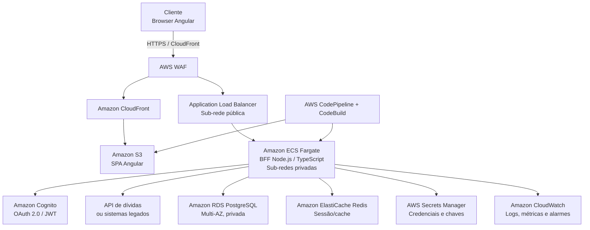

# Renegociação de Dívidas

Protótipo full stack para visualização e simulação de renegociação de dívidas. A experiência do cliente contém duas telas: **Dívidas** e **Simular proposta**. A autenticação é realizada por um diálogo de acesso, evitando introduzir uma terceira tela.

## Arquitetura AWS



### Decisões principais

- O CloudFront distribui a SPA a partir de um bucket S3 privado, com OAC. O WAF protege tanto a borda quanto a API contra regras comuns e limitação de requisições.
- O BFF executa em ECS Fargate, sem IP público, com auto scaling orientado por CPU, memória e volume de requisições. O ALB é o único ponto público da API.
- O Cognito emite e valida a identidade do cliente. O BFF valida o JWT e aplica autorização por dono da dívida antes de consultar ou simular qualquer proposta.
- RDS Multi-AZ guarda acordos e trilha de auditoria; criptografia em repouso usa KMS. Secrets Manager elimina segredos em variáveis versionadas.
- CloudWatch, CloudTrail e alarmes dão rastreabilidade operacional. Em produção, os dados de dívidas devem vir de APIs internas por PrivateLink/VPN, sem expor o legado à internet.

## Estrutura

```text
renegociacao-dividas/
├── frontend/       # Angular standalone, Signals, Material e Jest
└── backend/        # BFF Node.js/TypeScript em camadas SOLID
```

Os nomes de domínio e das pastas criadas para o produto estão em português; arquivos estruturais convencionais do Angular permanecem com seus nomes padrão.

## Como executar

Pré-requisito: Node.js 22.12 ou superior.

```powershell
cd backend
npm ci
copy .env.example .env
npm run dev
```

Em outro terminal:

```powershell
cd frontend
npm ci
npm start
```

Acesse `http://localhost:4200` e autentique com `cliente@exemplo.com` e `123456`.

## Testes

```powershell
cd backend; npm test
cd frontend; npm test
```

## Princípios aplicados no BFF

- **SRP:** controladores HTTP, casos de uso, validações e repositórios têm responsabilidades isoladas.
- **OCP/DIP:** os casos de uso recebem interfaces de repositório; a implementação em memória pode ser trocada por uma integração real sem alterar regras de negócio.
- **ISP:** contratos pequenos (`RepositorioDividas`, `ServicoToken`) evitam dependências desnecessárias.
- **Segurança:** Helmet, CORS restrito, rate limit, validação Zod e autenticação Bearer JWT nas rotas de negócio.
