# Renegociação de Dívidas

<!-- Evidências do site: visualização rápida sem rodar -->

**Evidências — Web**

<p align="center">
  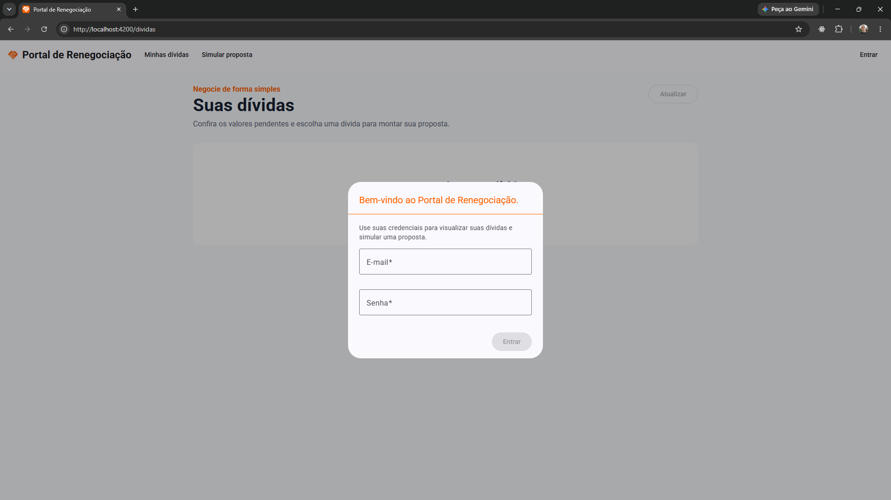
  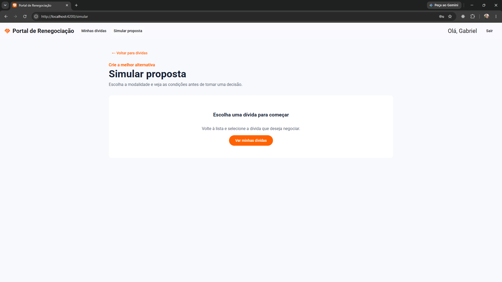
  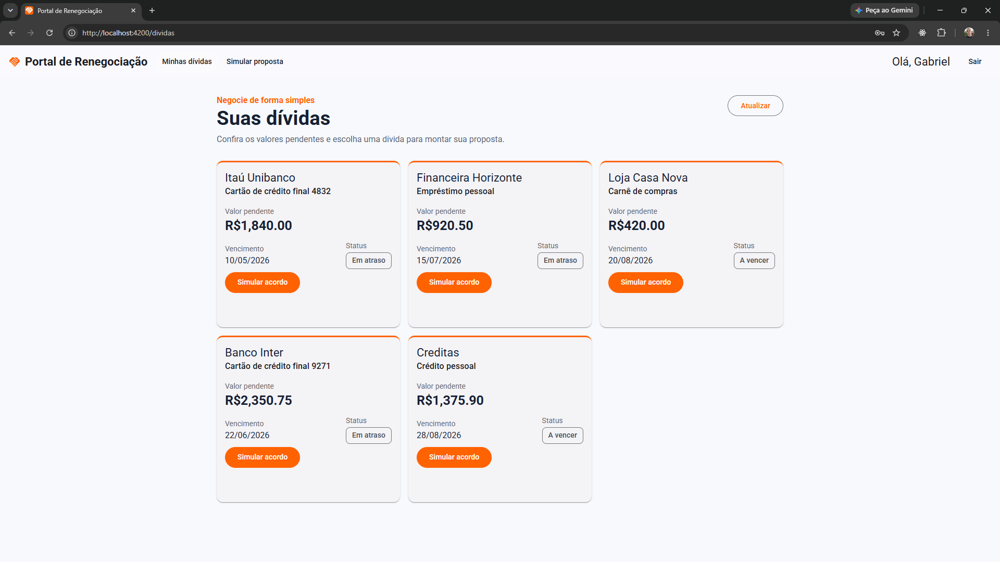
  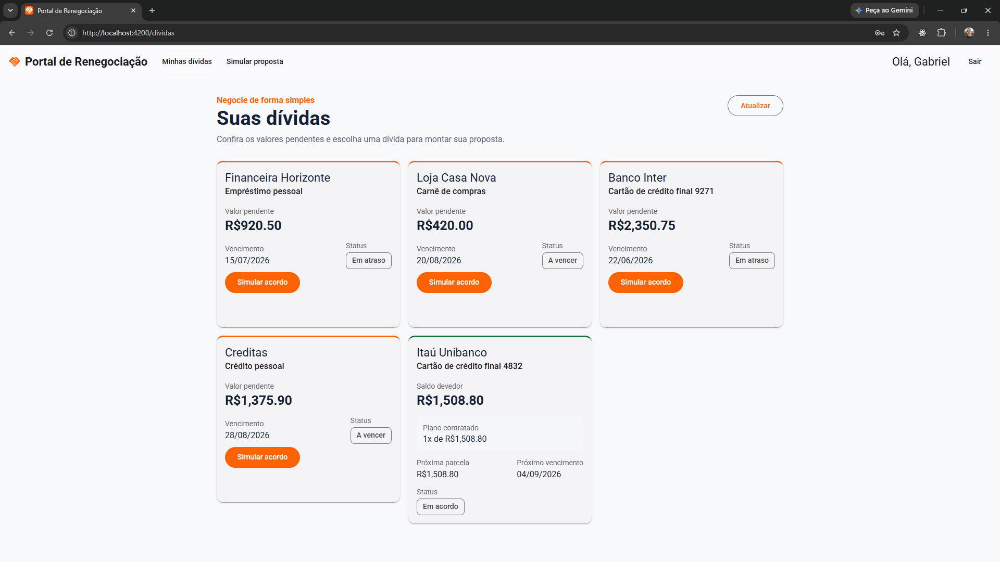
  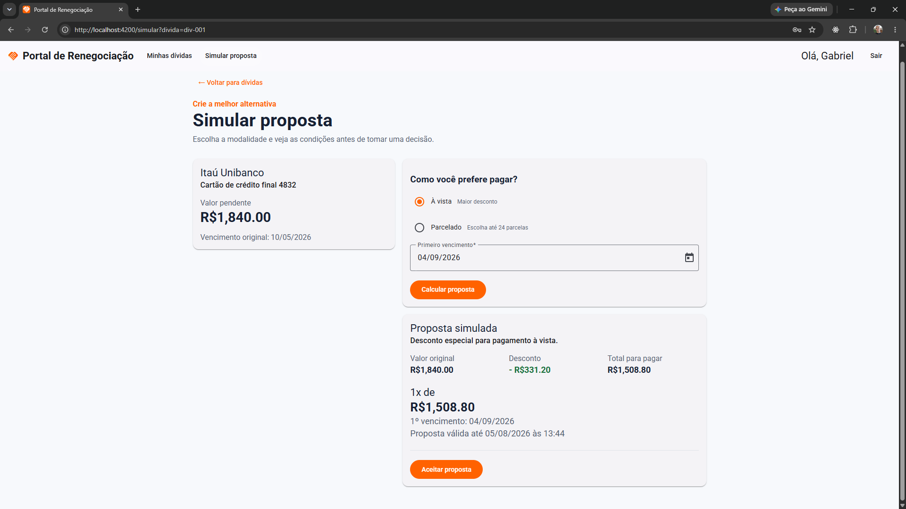
  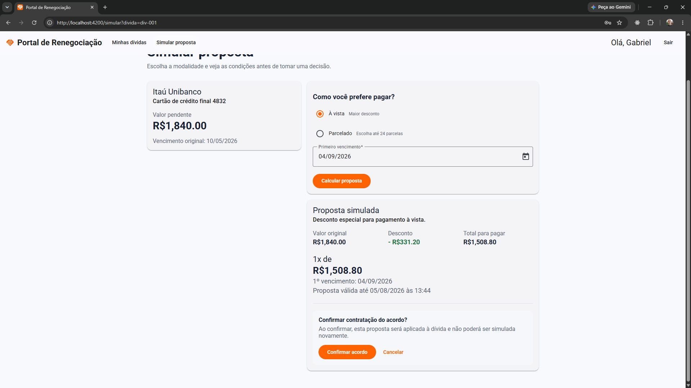
  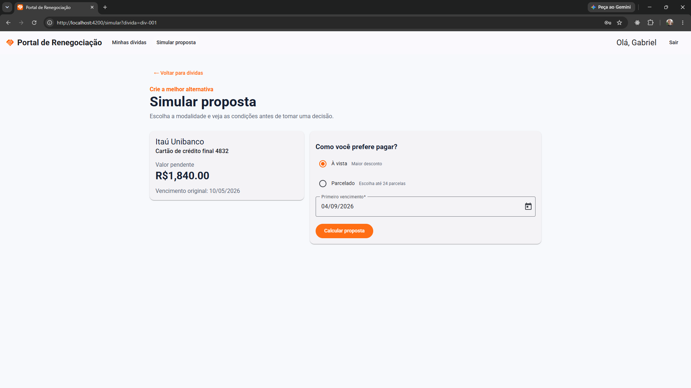
  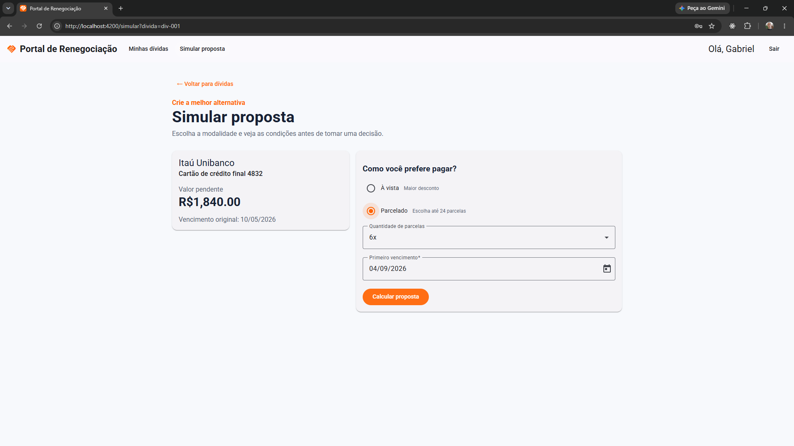
  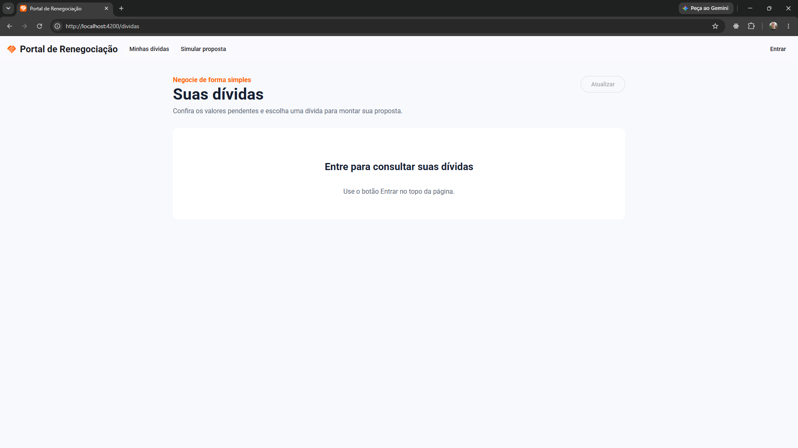
</p>

**Evidências — Mobile**

<p align="center">
  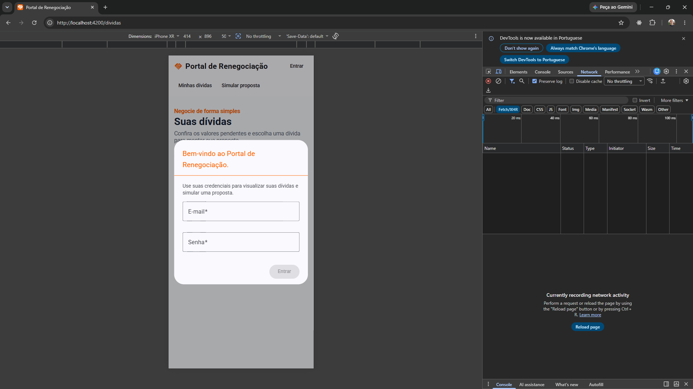
  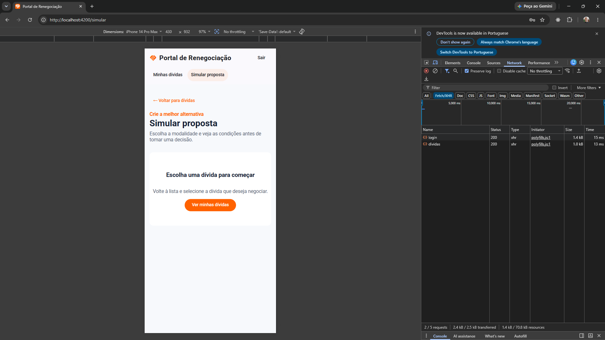
  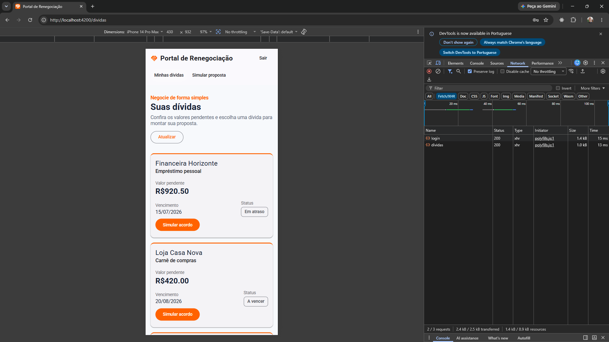
  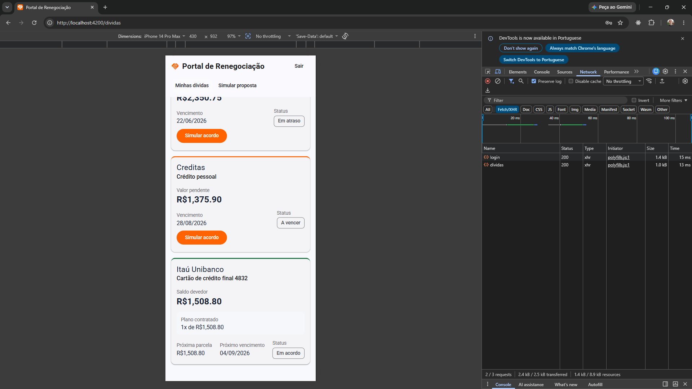
  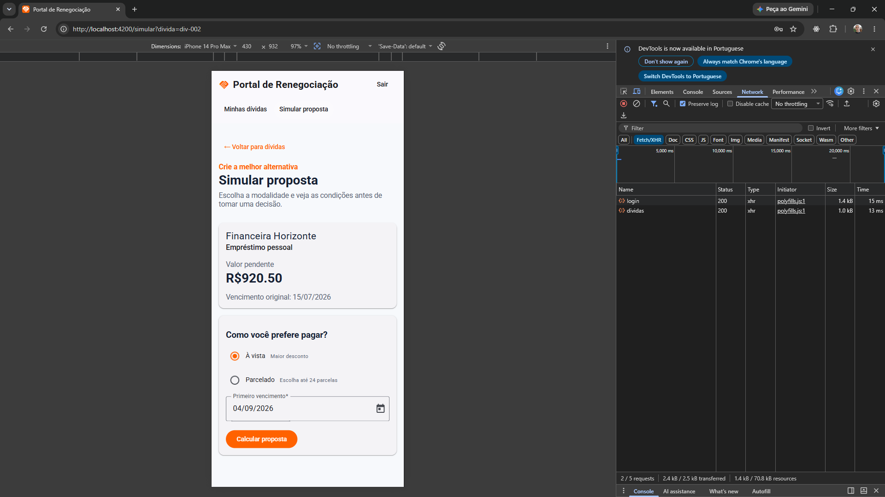
  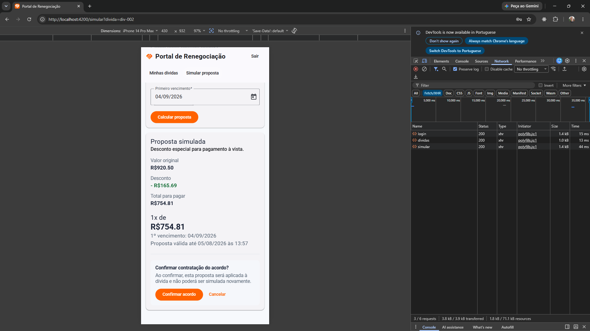
  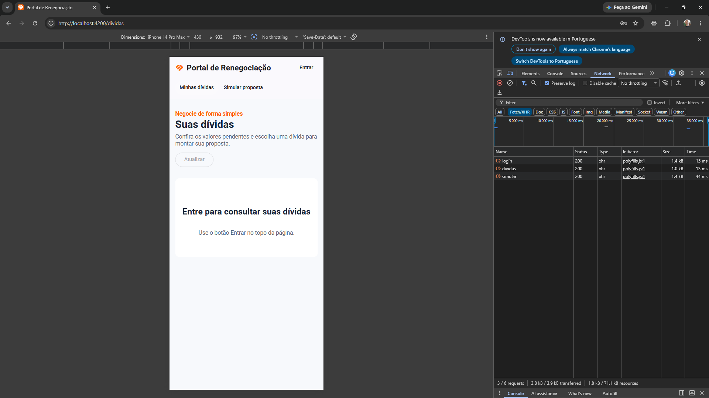
</p>

Protótipo full stack para visualização, simulação, aceite e contratação de renegociação de dívidas. A experiência do cliente contém duas telas: **Dívidas** e **Simular proposta**. Na tela de simulação, o cliente calcula as condições, revisa a proposta gerada e confirma explicitamente o aceite antes da criação do acordo. A autenticação é realizada por um diálogo de acesso, evitando introduzir uma terceira tela.

## Fluxo de negociação

1. O cliente escolhe uma dívida e informa modalidade, parcelas e primeiro vencimento.
2. O BFF calcula e armazena uma simulação temporária identificada, com prazo de validade.
3. O cliente revisa os valores e confirma explicitamente o aceite da proposta.
4. O BFF valida titularidade, validade e elegibilidade antes de criar o acordo.
5. A dívida passa para **Em acordo** e a lista apresenta o saldo negociado, as parcelas e o próximo vencimento, preservando o valor original para auditoria.

O aceite é idempotente: repetir a mesma requisição retorna o acordo já criado, sem duplicá-lo. Quando o arredondamento das parcelas produz diferença de centavos, a última parcela é ajustada para que a soma corresponda exatamente ao valor negociado.

No protótipo, dívidas, simulações e acordos ficam em memória e são reiniciados junto com o backend. Em produção, a criação do acordo e a atualização da dívida devem ocorrer na mesma transação no banco de dados.

### Aceite da simulação

Depois que a proposta é calculada, a interface exibe valor original, desconto, total negociado, quantidade de parcelas, valor da parcela, eventual ajuste da última parcela, primeiro vencimento e validade da proposta. O botão **Aceitar proposta** abre uma confirmação final; somente ao clicar em **Confirmar acordo** o frontend envia o aceite ao BFF.

O backend aceita apenas propostas pertencentes ao cliente autenticado, ainda dentro do prazo de validade e vinculadas a uma dívida que continua elegível. Ao confirmar o aceite, o BFF cria um acordo ativo, registra o horário do aceite, atualiza a dívida para **Em acordo** e impede novas simulações para a mesma dívida. Se a proposta expirar, o cliente deve gerar uma nova simulação.

### Endpoints do fluxo

- `GET /api/dividas`: lista as dívidas e os dados de eventual acordo ativo.
- `POST /api/propostas/simular`: cria uma simulação temporária calculada pelo servidor.
- `POST /api/propostas/:id/aceitar`: aceita uma simulação válida e cria o acordo.

Principais retornos do aceite:

- `200`: acordo criado ou acordo já existente para a proposta.
- `404`: proposta inexistente para o cliente autenticado.
- `410`: proposta expirada.
- `409`: dívida não está mais elegível para acordo.

## Arquitetura AWS proposta

O diagrama abaixo representa uma possível arquitetura de produção na AWS. Esses
serviços não estão provisionados nem são consumidos pelo protótipo atual, que
executa o frontend e o BFF localmente e mantém os dados em memória.

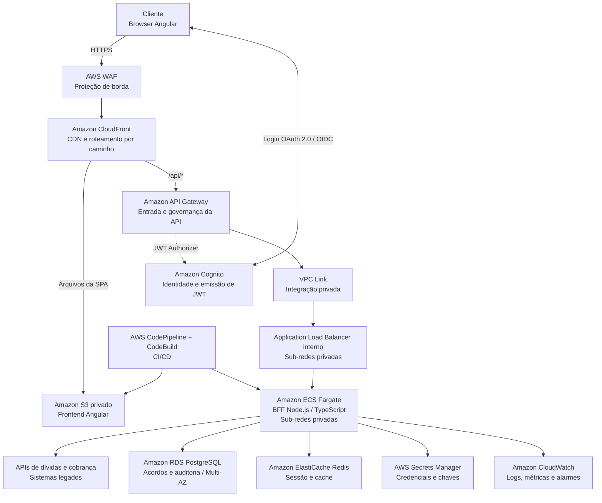

### Decisões principais

- O CloudFront distribui a SPA a partir de um bucket S3 privado, com OAC, e encaminha chamadas `/api/*` ao API Gateway. O WAF protege a distribuição contra ataques comuns e abuso de requisições.
- O API Gateway centraliza a entrada da API, autorização JWT, throttling, estágios, métricas e políticas. Um VPC Link o conecta ao ALB interno sem expor diretamente o BFF à internet.
- O BFF executa em ECS Fargate, sem IP público, com auto scaling orientado por CPU, memória e volume de requisições. O ALB distribui internamente as chamadas entre as tarefas do ECS.
- O Cognito autentica o cliente e emite o JWT. O API Gateway valida o token, enquanto o BFF continua responsável pela autorização de negócio, conferindo a titularidade da dívida.
- RDS Multi-AZ guarda acordos e trilha de auditoria; criptografia em repouso usa KMS. Secrets Manager elimina segredos em variáveis versionadas.
- CloudWatch, CloudTrail e alarmes dão rastreabilidade operacional. Em produção, os dados de dívidas devem vir de APIs internas por PrivateLink/VPN, sem expor o legado à internet.

## Estrutura

```text
renegociacao-dividas/
├── frontend/       # Angular standalone, Signals, Material e Jest
└── backend/        # BFF Node.js/TypeScript em camadas SOLID
```

Os nomes de domínio e das pastas criadas para o produto estão em português; arquivos estruturais convencionais do Angular permanecem com seus nomes padrão.

## Como executar localmente

Execute os comandos abaixo a partir da raiz do repositório.

### Pré-requisitos

- Node.js `^20.19.0`, `^22.12.0` ou `>=24.0.0`, conforme os requisitos do Angular 20. Recomenda-se a linha 22 LTS, a partir da versão 22.12.
- npm e acesso à internet para instalar as dependências. O frontend também carrega Google Fonts durante o desenvolvimento e o build.
- Dois terminais livres, um para cada aplicação.

### 1. Instalar as dependências

```bash
npm --prefix backend ci
npm --prefix frontend ci
```

### 2. Configurar o backend

Na primeira execução, copie o arquivo de exemplo. No Linux ou macOS:

```bash
cp backend/.env.example backend/.env
```

No Windows PowerShell:

```powershell
Copy-Item backend/.env.example backend/.env
```

O exemplo configura a API em `http://localhost:3000` e permite requisições do frontend em `http://localhost:4200`. Se uma dessas portas mudar, ajuste `ORIGEM_PERMITIDA` no backend e `apiUrl` em `frontend/src/app/environment.ts`.

### 3. Iniciar as aplicações

No primeiro terminal, inicie o backend em modo de desenvolvimento:

```bash
npm --prefix backend run dev
```

No segundo terminal, inicie o frontend:

```bash
npm --prefix frontend start
```

A API estará disponível em `http://localhost:3000/api`, com verificação de saúde em `http://localhost:3000/api/saude`. Acesse `http://localhost:4200` e autentique com `admin.demo@email.com` e `admin9090@`.

## Testes e build

Os comandos também devem ser executados a partir da raiz:

```bash
npm --prefix backend test
npm --prefix frontend test
```

Para executar os testes durante o desenvolvimento:

```bash
npm --prefix backend run test:watch
npm --prefix frontend run test:watch
```

Para validar os builds:

```bash
npm --prefix backend run build
npm --prefix frontend run build
```

Após o build, o backend pode ser iniciado com `npm --prefix backend start`. Os arquivos estáticos do frontend ficam em `frontend/dist/portal-renegociacao-dividas`. A configuração atual do frontend aponta para a API local; um deploy em outro ambiente deve fornecer uma configuração de `apiUrl` específica para esse ambiente.

## Princípios aplicados no BFF

- **SRP:** controladores HTTP, casos de uso, validações e repositórios têm responsabilidades isoladas.
- **OCP/DIP:** os casos de uso recebem interfaces de repositório; a implementação em memória pode ser trocada por uma integração real sem alterar regras de negócio.
- **ISP:** contratos pequenos (`RepositorioDividas`, `ServicoToken`) evitam dependências desnecessárias.
- **Segurança:** Helmet, CORS restrito, rate limit, validação Zod e autenticação Bearer JWT nas rotas de negócio.
